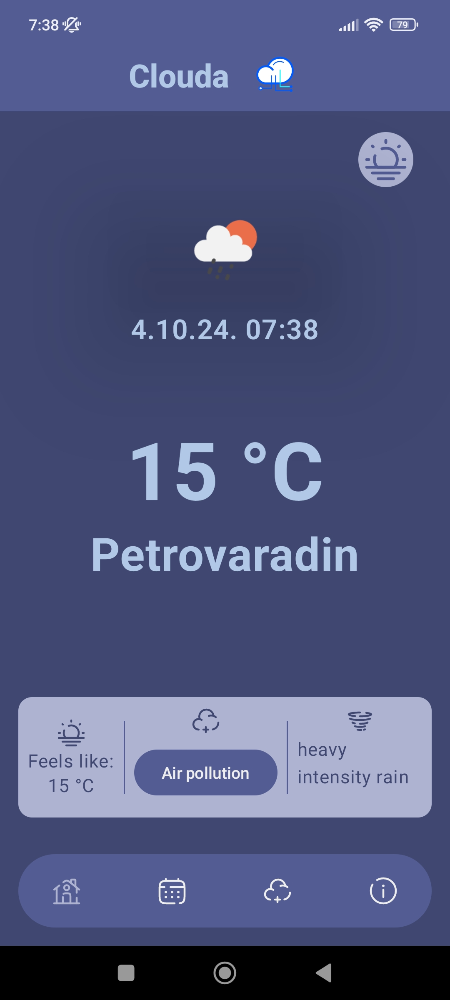

    
    <h1 align="center">Clouda ☁️</h1>

  
  

## 🌐 About app

This app is implementation of Forecast REST-Api.It is showing current weather,weather forecast for seven days ahead.It also includes air pollution data and about app screen.

## 📱 Screenshots
### App Themes
|  |  | 
|:---:|:---:|
|Dark theme| White theme|

### Navigation screens
| | | |
|:---:|:---:|:---:|
| Home | Weekly Forecast | Air Pollution |

## 🧭 Navigation never been made easier 
Self-explanatory interface without overloaded menus.

## 🎨 Colorful
You can choose between two different main themes: White and Dark.

## 🏠 Home
Where you can view current weather forecast for your location.

## 📆 Weekly forecast
Where you can check forecast for seven days ahead for your location.

## 📦 Included Features
-  Base 2 themes (White,Dark)
-  Splash screen
-  Animations while navigating
-  Requesting location permission
-  Current weather data
-  Forecast for seven days ahead
-  Air pollution data for your location
-  About screen with web view inside it

## 👨‍💻 Used technologies
-  Kotlin programming language
-  Jetpack Compose
-  Kotlin Flow
-  Retrofit
-  Android View
-  Kotlin coroutines
-  Koin
-  Coil(image loading library)
-  Clean architecture
-  MVVM design pattern
-  Multi Modular Architecture
-  Use cases
-  Material 3 design
-  Splash screen API
-  Compose navigation
